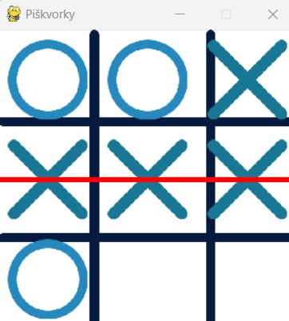

# Piškvorky (Tic-Tac-Toe)

Tento projekt implementuje hru Piškvorky (Tic-Tac-Toe) pomocou knižnice Pygame. Hra umožňuje dvom hráčom striedať sa pri umiestňovaní znakov (X a O) na hraciu dosku (pomocou myši), pričom hra detekuje výhernú kombináciu a zvýrazňuje víťaznú líniu.

# Ilustráčny obrázok

## Použitie

1) Kliknutím myšou umiestnite svoj znak (X alebo O) na hraciu dosku.
2) Hráči sa striedajú po každom kliknutí.
3) Hra deteguje víťaznú kombináciu a zvýrazní ju červenou čiarou.

## Konfigurácia

Konfiguračné nastavenia, ako napríklad rozlíšenie obrazovky, farby, FPS, atď. sú uložené v súbore config.py. Tam môžete upraviť tieto hodnoty podľa vlastných preferencií.

# Funkcie v projekte
<b>def setup_game(window):<b>

    - Načíta a nastaví obrázky hracej dosky, X a O.
    - Zmení veľkosť obrázkov X a O.
    - Vyplní pozadie hracej obrazovky farbou pozadia.
    - Zobrazí hraciu dosku na obrazovke.
    - Vráti obrázky X, O a hracej dosky.

<b>def draw_figures(window, board, x_img, o_img):</b>

    - Iteruje cez hraciu dosku.
    - Vykreslí X alebo O na príslušné miesto na hracej doske,   ak  sú tieto znaky umiestnené na doske.

<b>def check_win(board):</b>

    - Kontroluje, či existuje víťazná kombinácia v riadkoch,   stĺpcoch alebo diagonálach hracej dosky.
    - Ak nájde víťaznú kombináciu, vráti víťaza ('X' alebo 'O').
    - Ak doska nie je plná a nie je žiadny víťaz, vráti None.
    - Ak je doska plná a nie je žiadny víťaz, vráti "DRAW".

<b>def highlight_winner(window, board, winner):</b>

    - Zvýrazní víťaznú kombináciu čiarou na hracej doske.
    - Kreslí čiaru cez víťaznú kombináciu v riadkoch, stĺpcoch alebo diagonálach.
    
<b>main()</b>

    - Inicializuje Pygame a vytvorí herné okno.
    - Nastaví hru volaním funkcie setup_game.
    - Inicializuje hraciu dosku a ďalšie premenné.
    - Hlavná herná slučka:
    - Spracováva udalosti, ako je kliknutie myšou a ukončenie hry.
    - Vykresľuje hraciu dosku a umiestnené X a O znaky.
    - Kontroluje víťazné kombinácie.
    - Zvýrazňuje víťazné kombinácie, ak existujú.
    - Aktualizuje obrazovku a obmedzuje snímkovú frekvenciu.

## Podrobnejší popis

Prečítajte si jednotlivé commity od 0 smerom nahor. Sú výstižne pomenované, aby sme vedeli čo sme v nich riešili.